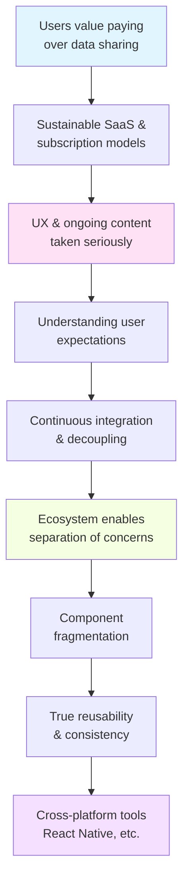

1. users are understanding the value of paying for products and the risk of giving away data - friends moving away from google to Apple

<!--truncate-->

2. Companies are able to build sustainable products thanks to subscription models and Saas prevelance. Last missing piece here is the apple App Store - it is their closed system that will enable all this
3. As part of SaaS model adoption, user experience and providing users with ongoing engaging content is taken seriously.
4. Taking user experience seriously requires understanding user expections and providing consistent and expected experiences (99% of the time)
5. Ongoing improvement requires continuous integration, and decoupling to enable efficient refactoring
6. Underneath all this, the development ecosystem is allowing fragmentation and seperation of concerns in a way that allows seperation of structure, style (styled components), functionality (eg lambda)
7. Fragmenting and packing up components
8. Fragmentation enables true reusability, and therefore consistency, whilst the decoupling of style/ functionality allows customisation - recognised by Google with their revamped material design approach allowing that flexibility
9. Finally, tools like React native enable cross compatibility and therefore consistency like never before. The blend of native and custom is great too

All other tech trends are secondary to this. Until the basics are solved, consistently, (e.g forms) how can users truly maximise their benefit from AI innovations, etc.
