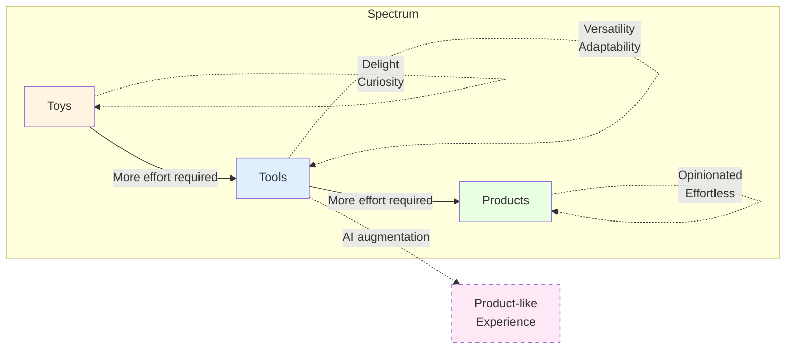

A foundational part of product management, often overlooked, is understanding the nuanced difference between toys, tools, and products.

<!--truncate-->

Toys are experiences rather than solutions. They delight us, invite curiosity, and provide intrinsic enjoyment. A good toy doesn't necessarily accomplish anything practical—but that's precisely why it resonates. Delight itself is its success metric.

Tools, by contrast, are explicitly designed to solve problems. A hammer doesn't build a chair on its own; it demands your effort, skill, and intention. Tools have versatility, providing a blank canvas for creativity. Their strength lies in their adaptability—but this flexibility comes at the cost of effort and expertise from the user.

Products, then, sit distinctly apart. They solve problems for you, reducing your effort significantly or enhancing your capabilities dramatically. Products have strong opinions about how problems should be tackled, embodying a clear vision of "good." This opinionation makes products incredibly useful, yet sometimes less versatile.

Consider Adobe Photoshop. Often mistaken as a product, it's really a sophisticated toolkit—a collection of powerful tools demanding considerable skill and intentionality to extract meaningful value. This is neither inherently good nor bad, but it's crucial to recognize the distinction as a product manager.

There's an inherent trade-off as you transition from tool to product. To deliver effortless value, a product must become increasingly opinionated about the ideal process or outcome. This opinionation is a strength, clarifying purpose and reducing friction—but it's also a limitation, potentially narrowing its applications.

Where products falter, sliding back into toolkits, it's typically because they've failed to maintain a strong enough viewpoint. Without clear opinions on "what good looks like," they leave users stranded in complexity, shifting the burden of understanding back onto them.

In product management, the insight lies in consciously choosing your position on this spectrum—embracing the delightful simplicity of toys, harnessing the adaptable power of tools, or delivering the confident utility of a product.

---

**Additional note, 12/04/2025:**
AI is reshaping this spectrum, augmenting complex toolkits with intuitive usability layers that effectively transform them into products. By embedding intelligence, AI bridges the gap between user effort and utility, enabling previously demanding tools to deliver effortless, product-like experiences.