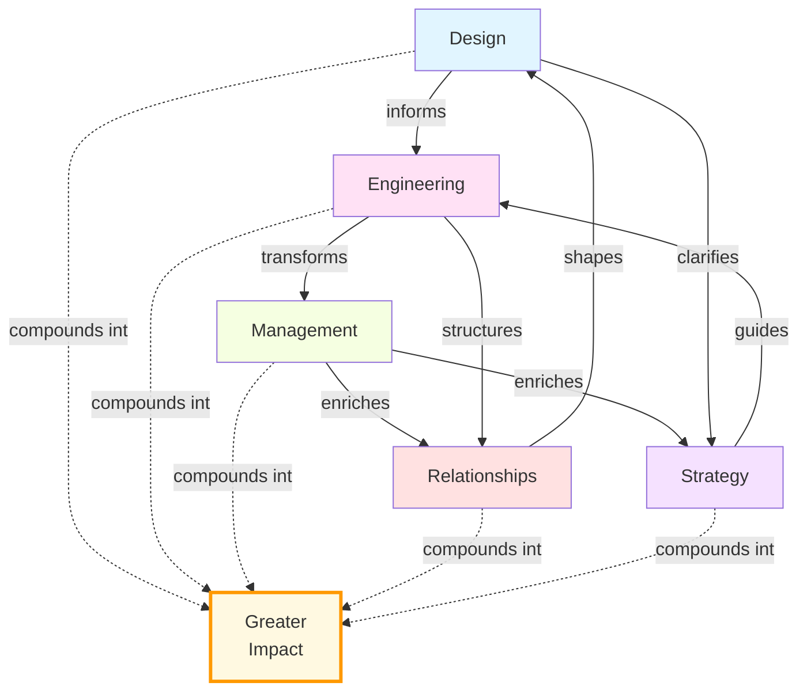

I've long embraced generalism—dipping into different disciplines, interests, and ideas. I often worried this approach meant sacrificing depth for breadth, leaving me moving slowly in many directions rather than swiftly in one.

<!--truncate-->

Yet, lately, I've noticed the slow, steady accumulation of small victories across diverse fields is compounding into something more. Insights from design inform my approach to engineering; lessons from engineering transform my management style; experiences in management enrich my understanding of relationships and strategy.

Compounding progress isn't linear or immediately apparent. It simmers quietly beneath the surface, until one day you realize you're far ahead of where you thought you'd be—not despite the winding path, but precisely because of it.

Generalism doesn't dilute impact. It compounds it. 