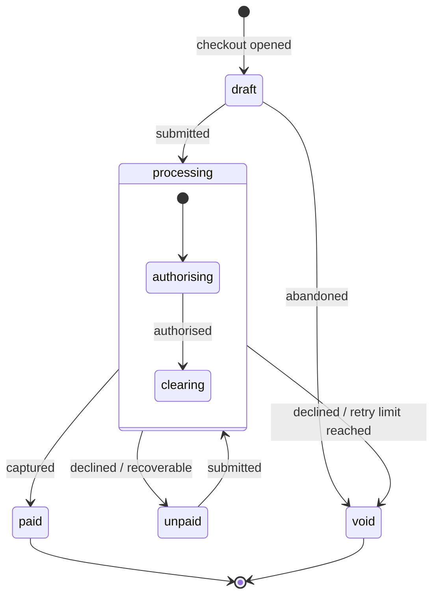

A status field is a contract. It is also the place where most APIs quietly leak ambiguity, a single word doing the work of three, consumed by people who weren't in the room when you named it. Get it right and an integrator can build correct handling from the payload alone. Get it wrong and they reverse-engineer your intentions from support tickets.

This is a short account of how to model state, name it, and expose it. The running example is a Stripe-style online purchase.

Three carriers share that contract, and most of the trouble comes from loading all three onto one field. An **event** records what just happened, in the past tense, on the webhook envelope. A **status** says where the resource is now, in the present tense — the state machine. An **issue** says why, and what to do about it — a structured annotation carried alongside the response. Keep each to its own question and most of what follows is just consequences. The status is the one this piece is mostly about, because it's the one that gets overloaded. The full treatment of the split comes near the end; for now, hold the three apart.

## Validate the example first

The intuition was: a purchase opens in `draft` at checkout, moves to `pending` when the transaction is attempted, then resolves to `failed` or `succeeded`. Reasonable, and close to how people talk. But it isn't how Stripe actually models it, and the difference is instructive.

Stripe's `PaymentIntent` runs through `requires_payment_method`, `requires_confirmation`, `requires_action`, `processing`, and ends at `succeeded` (or `requires_capture` when capture is deferred), with `canceled` as the only other terminal state. One of its choices is worth stealing outright. The other is the one everybody copies, and it's the one I've come round to thinking is a quiet mistake.

**It names states by what's needed next, and that's the trap.** `requires_action` tells the consumer to *do something*: surface a 3DS challenge. That's useful, which is why the pattern spreads. But notice what the name describes — the consumer's to-do list, not the resource's condition. It's the future tense in a status field. The same instinct produces `pending` and `requires_payment_method`, and `pending` is the tell. It's close to meaningless: every live state is pending something, every live state requires something next, so the word only separates "not done" from "done" — which the terminal states already tell you. It's the one name guaranteed not to say which state you're actually in. `requires_` is the same word with the obligation spelled out; it discriminates a little better, but it's still describing the future instead of the present.

That's the mirror of a mistake the post returns to below. Name a state for what just *happened* and the status becomes the last event echoed back. Name it for what must happen *next* and it becomes a to-do list. Either way the status has borrowed its job from a neighbour that already does it: the event carries the past, the issue carries what to do. The one job left over, the status's own, is the present tense — what the resource *is* right now.

Drop the obligation from the name and the actionability doesn't vanish, it relocates. `requires_action` splits into a present-condition status — `authentication_required`, naming the missing piece — and an issue that carries the *do this*: the challenge link, the severity, the copy you'd show a user. The status stays a steady description of where things stand; the instruction lives in the layer built for instructions.

**Failure is not terminal.** A declined card doesn't move to a dead-end `failed` state; the intent returns to `requires_payment_method` so the payment can be retried. Only success and explicit cancellation end the line. This is the assumption to break in your model. `failed | succeeded` treats failure as a sibling of success, an exit. But most failures are recoverable, and a terminal `failed` discards the path back. Ask of every failure: is this the end, or a detour? Usually it's a detour.

So the corrected shape: `draft` survives, `pending` doesn't (it names a wait, not a condition), failure mostly loops back, and only a small set of conditions are genuinely terminal.

## Start with the diagram

Before naming anything, draw the machine. Nodes are states, edges are transitions. Transitions may be conditional, bidirectional, or guarded. Drawing it does two things: it shows you where you've over-specified (states that can be collapsed because nothing distinguishes their transitions) and where you've under-specified (a single state whose edges are doing visibly different jobs, asking to be split).



Every name in that picture is a present condition: the purchase *is* a draft, *is* unpaid, *is* processing, *is* paid, *is* void. None of them say what's owed or what just happened. Note too what the diagram forces into the open. A decline has two edges, not one: back to `unpaid` when the buyer can try again, out to `void` only when retries are exhausted. `processing` has internal structure (authorising, then clearing) because those substates have genuinely different transitions. If they didn't, they'd be one state.

## Four questions to place a state

The diagram gives you the nodes. The next step is working out what *kind* of state each one is, because the kind decides the name. Four questions do most of the work, and each feeds a naming choice.

- **Is the system working, or waiting?** Either the system is doing something it will finish on its own, or the resource is parked waiting on someone else to act. The two clear differently and they name differently — the naming section below turns this into a rule.
- **Is it terminal?** Does the line end here, or does the resource move on? Keep terminal states for genuine ends — success, rejection, cancellation — and remember that failure usually isn't one (see above); it loops back.
- **Who unblocks it?** The system, the customer, a third party, or you. Even when this doesn't drive the status name, it decides the next move: a state someone else owns is one you wait or chase on, not one you act on.
- **Does it turn on a clock?** A state that can expire — an SLA, a settlement window, an authentication that lapses — needs an explicit transition for the timeout, and usually an issue carrying the deadline while the clock runs.

None of these is a naming rule by itself. They're the questions the name should answer, so a consumer reading the status reconstructs them without asking you.

## Three things every status should carry

A well-formed status is three segments in one string, `{domain}.{state}.{substate}`, so `purchase.processing.authorising` reads as a purchase (domain) that is processing (state), specifically authorising the payment (substate). Each segment is broader than the one after it.

**Domain.** The status belongs to a purchase. You may assume this is implied by context, and in a single endpoint it usually is. It stops being implied the moment you have an aggregated webhook consumer fielding events from several resource types, or more than one kind of purchase exposed through one stream. Encode the domain so the status is legible without its envelope. A status that only makes sense once you know which endpoint delivered it is half a status.

**State.** The condition the resource is in: `draft`, `unpaid`, `processing`, `paid`, `void`. Each names what the resource *is*. This is the part most people mean when they say "status."

**Substate.** Genuine substructure within a state. `processing` almost always has it — authorising, clearing, settling — and those may nest further, because each substate has different transitions. Be careful what you let in here, though. The substate is for *where* the resource is, not *why* it got there. The reason a payment failed, and whether it's recoverable, is a separate concern with a separate home, covered below. A substate that starts absorbing failure reasons is quietly turning into an error field.

## The middle segment is an axis, not a fixed slot

The section above calls the middle segment "the state," and in the purchase example it is one. But that's the default, not a law. The middle segment is really an *axis* — the dimension you've chosen to group by — and the state is just the most common choice. Two others earn their keep.

You can group by **phase**, the stage of the lifecycle the resource sits in: a KYB onboarding running `kyb.disclosure.not_started`, `kyb.disclosure.incomplete`, `kyb.disclosure.complete`, where `disclosure` is the phase and the leaf says where the subject is within it. You can group by **sub-process**, as the purchase's `processing` does, gathering the in-flight states (`authorising`, `clearing`) under one composite. Or you can group by **actor** — who owns the next move, the third of the four questions above — so `kyb.awaiting_user.not_started` collects every state where the ball is in the subject's court, against a `kyb.in_review` where it's in yours.

The choice matters because the prefix is the cheap thing to branch on. A consumer splits on the dot and matches the middle segment without reading further, so whatever sits there is the question you've made easiest to answer. Group by actor and "whose move is it" is a one-segment match; group by phase and "what stage are we at" is. You can usually recover the other axes — phase carries the actor almost for free, a disclosure state being the subject's and a review state yours — but recovery costs a lookup the prefix would have saved.

So pick the axis your dominant consumer reads most. A dashboard chasing the right party wants the actor up front; a pipeline view tracking progress wants the phase. The grammar doesn't change. What changes is the question you've answered for free.

## Naming

Start with the edges, because verbs are easier to agree on than nouns.

**Events are past-tense verbs**, namespaced to the domain: `purchase.submitted`, `purchase.authorised`, `purchase.captured`, `purchase.declined`. They record a transition that has completed. The past tense is the point, since an event is a thing that happened.

**States are conditions, and a condition is something true in the present.** This is where two instincts break down at once. One conjugates everything to `-ed` to match the events; the other reaches for `requires_` or `pending` to say what's owed. Neither names the present. `draft`, `unpaid`, `paid`, `void` aren't a tidy grammatical family, and forcing them to be — `drafted`, `pendinged` — produces nonsense. The rule worth holding isn't a suffix. It's three things at once: each name describes a present condition, the category stays consistent (pick adjectives, or pick participles, and stay there), and the states stay distinct from the events.

Naming the present condition has two shapes, and which one fits turns on who's going to resolve the state. When the *system* is doing the work — authorising a charge, settling funds, running a check — something genuinely is in progress, and the present-progressive `-ing` is exactly right: `authorising`, `clearing`. The name says what the machine is busy with, and the state clears itself with no one prompted. When the resource is instead parked waiting on someone else, usually the user, nothing is in progress and an `-ing` would lie — there's no work happening, the thing is blocked. Name what's blocking it: `unpaid`, or `authentication_required` for the 3DS state from earlier. That's still a present fact, what's missing right now, and unlike `pending` it discriminates — it says *which* gap you're stuck on, which is exactly what the consumer has to act on. The tell is word order: `authentication_required` reads as a condition, that authentication is the missing piece, while `requires_authentication` reads as a demand to go and do something. The first describes the present, the second points at a future step. Lead with the missing thing.

The distinctness from events is the part to take seriously, and it's more than cosmetic. When the natural name for a state is the same word as the event that produced it — the `captured` event lands you in a `captured` state — that collision is a diagnostic, not a coincidence. It usually means the state is just "the last event, echoed back." You've recorded what happened in the field that's supposed to tell you where you are. A well-formed state names the condition the entity is now in, which is generally a different word from the transition that got it there. If you can't find that different word, the state model is probably under-specified.

The disambiguation that always works is structural rather than lexical: events and states live in different fields and different namespaces. `event.type` is one thing; `object.status` is another. Even when the vocabulary overlaps, the location resolves it.

## Enums or parseable strings

Decide whether your state space is stable enough to commit to an enum. If you expect to add or split statuses, every addition is a potential breaking change for anyone who wrote an exhaustive `switch`. That's a real cost, and it's paid by your integrators, not you.

The dot-separated string is the usual middle path:

```json
{
  "status": "purchase.processing.authorising"
}
```

The whole string carries a specific meaning. The consumer can also `split('.')` it and act on the parts: branch on the domain, group by state, drill into the substate. It degrades gracefully: code that only cares about `purchase.processing` can match the prefix and ignore what follows.

But be honest about what you've traded. You haven't removed the breaking-change problem; you've moved it somewhere less visible. The moment consumers parse the string, its *grammar* is your contract: the segment count, the ordering, the meaning of each position. Add a fourth segment (`purchase.processing.authorising.challenge`) and you break anyone doing exact-match; you spare anyone doing prefix-match. So tell consumers which discipline to use. Match on prefixes, treat unknown deeper segments as "more specific than I handle," and never assume a fixed depth. An implicit grammar that nobody documented is more fragile than an enum, precisely because nobody agreed to it.

This is also where Stripe's other choice is worth weighing against yours. It keeps the *why* out of the status and in a sibling field, `cancellation_reason: fraudulent`. Reason-as-field versus reason-as-segment is a genuine fork. The segment keeps everything legible in one string and survives transport that drops sibling fields. The field is easier to extend without touching the status contract, and easier to make optional. Once you accept that the *why* belongs beside the status rather than inside it, the next question is what shape that sibling takes, which is where status stops being the whole story.

## A parent segment is a container or a value, never both

Grouping by a middle segment forces one more decision: whether that segment is ever a state in its own right. It can't be both, and the failure is quiet.

Say review has an in-progress condition and two outcomes. The compact temptation is to let a bare `kyb.review` mean "in review," with `kyb.review.approved` and `kyb.review.rejected` for the outcomes. It reads well. But now a consumer matching the prefix `kyb.review` can't separate "still in review" from "review concluded, approved" — the bare value and its own children fall under the same match. The prefix has stopped discriminating the one thing the consumer most needs to know.

So keep parents honest: a segment is either a pure container, where every state under it carries a leaf (`review.in_progress`, `review.approved`, `review.rejected`, no bare `review`), or it's a flat state with no children. A bare parent that also has children is exactly the case where `startsWith` lies — and prefixes not lying was the whole reason to prefer a dot-string over an opaque code.

The trap is worst with terminal children. Were review's children all sub-conditions of being in review — `review.escalated`, `review.awaiting_committee` — a bare parent would at least be honest, since they're all kinds of "in review." It's the children that mean review is *over* that turn the bare parent into a false signal.

## Status, event, issue: three questions

A status field gets overloaded because it's asked three questions at once, and they aren't the same question. Pull them apart and each gets a cleaner home.

- *What just happened?* The **event**, a past-tense verb on the webhook envelope. `purchase.declined`.
- *Where is the resource now?* The **status**, one persistent value, the state machine. `purchase.unpaid`.
- *Why, and what should I do about it?* An **issue** — a structured annotation carried alongside the response, with a namespaced code, a severity, a human-readable message, and links to docs, retry, or support.

The failure case shows why the separation pays. When a card is declined: the event is `purchase.declined`; the status reverts to `purchase.unpaid` — the purchase's present condition, the same value whether it's the first attempt or the fourth; and the reason lives in an issue, `payment.declined.insufficient_funds`, severity `error`, with a retry link while retries remain and none once they don't. The decline reason never enters the status. The status stays honest about the present condition; the issue carries cause and remedy. The "show different copy on the second attempt" requirement falls out of this for free — it's the issue's message, plus the presence of an earlier decline in the history — with no `unpaid.awaiting_new_card` state, which would only name an obligation and then beg the question of what the third attempt is called.

This also retires the bespoke reason field floated a moment ago. The sibling that holds the *why* isn't an ad-hoc `last_decline_reason`; it's a consistent issues structure, the same shape across API responses, webhooks, and UI callbacks. One pattern, every surface.

And the two namespaced strings, the status and the issue code, share one grammar: `{domain}.{primary}.{detail}`, read left to right from broadest to most specific, parsed by prefix. The domain plays the same role in each: the resource or area the code belongs to. The middle segment does not: in a status it's the *state* the resource is in (`unpaid`), in an issue it's the *class* of problem (`unauthorized`). That difference is the convention, not an inconsistency: a status answers *where the resource is*, an issue answers *why something went wrong*. The shape is shared so the parsing discipline can be too. Which means both face the same enum-or-string question — answer it once. Shipping the issue code as a forgiving string and the status as a strict enum, or the reverse, is a seam with nothing behind it.

## Where this is unresolved: `active`

One field resists the tidy split, and it's worth naming rather than papering over. An issue can carry an `active` flag: is this still ongoing, or already resolved? For a decline that's clean: it happened, it's over, the status holds whatever condition persists. But the moment an issue is `active`, persistent, and resolution-tracked — a device offline until it reconnects, an authorisation revoked until it's re-granted — the issue has started asserting a *state*. That's a second state machine hiding in a boolean, free to disagree with the status field that should own the same condition.

The line worth holding: status is the resource's current condition — one value, persistent, authoritative. Issues are annotations on a response — many, mostly transient, carrying cause and severity and remedy. When an issue wants to be persistently `active`, treat that as a signal the condition deserves a status of its own, and let the issue shrink back to the notification that the status changed. Where exactly that border falls — and whether `active` means "this request was blocked" or "this condition is ongoing," because it can't cleanly mean both — is the open question. How you answer it decides where one design ends and the other begins.

## The shape of a good rule

Name the transition for what happened. Name the state for what *is* — the present condition, not the last event and not the next obligation. Keep the vocabularies apart, and treat the cases where you can't as a question about your model rather than a quirk of English. Carry the domain even when it feels implied, because one day it won't be. And before you commit a status to the wire, ask what it's there to answer: *given this, what is true of the resource right now?* If the name answers that cleanly, it's done its job. The other question the consumer has — *so what do I do?* — isn't the status's to answer alone, and that's no failing. Part of that answer belongs to the event that got them here, part to the issue that says what's wrong. Three carriers, three questions. The discipline is keeping each to its own.