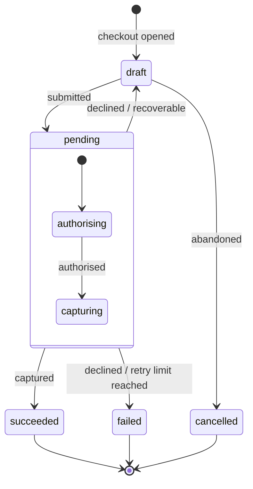

A status field is a contract. It is also the place where most APIs quietly leak ambiguity — a single word doing the work of three, consumed by people who weren't in the room when you named it. Get it right and an integrator can build correct handling from the payload alone. Get it wrong and they reverse-engineer your intentions from support tickets.

This is a short account of how to model state, name it, and expose it. The running example is a Stripe-style online purchase.

## Validate the example first

The intuition was: a purchase opens in `draft` at checkout, moves to `pending` when the transaction is attempted, then resolves to `failed` or `succeeded`. Reasonable, and close to how people talk. But it isn't how Stripe actually models it, and the difference is instructive.

Stripe's `PaymentIntent` runs through `requires_payment_method`, `requires_confirmation`, `requires_action`, `processing`, and ends at `succeeded` (or `requires_capture` when capture is deferred), with `canceled` as the only other terminal state. Two design choices are worth stealing.

**It names states by what's needed next, not by where they sit in a lifecycle.** `requires_action` tells the consumer to *do something* — surface a 3DS challenge. `pending` only tells them to wait. Obligation is more useful than position. A state name that implies the next move is doing more work than one that merely marks distance travelled.

**Failure is not terminal.** A declined card doesn't move to a dead-end `failed` state; the intent returns to `requires_payment_method` so the payment can be retried. Only success and explicit cancellation end the line. This is the assumption to break in your model. `failed | succeeded` treats failure as a sibling of success — an exit. But most failures are recoverable, and a terminal `failed` discards the path back. Ask of every failure: is this the end, or a detour? Usually it's a detour.

So the corrected shape: `draft` and `pending` survive as ideas, but failure mostly loops back, and only a small set of conditions are genuinely terminal.

## Start with the diagram

Before naming anything, draw the machine. Nodes are states, edges are transitions. Transitions may be conditional, bidirectional, or guarded. Drawing it does two things: it shows you where you've over-specified (states that can be collapsed because nothing distinguishes their transitions) and where you've under-specified (a single state whose edges are doing visibly different jobs, asking to be split).



Note what the picture forces into the open. A decline has two edges, not one — back to `draft` when the buyer can try again, out to `failed` only when retries are exhausted. `pending` has internal structure (authorising, then capturing) because those substates have genuinely different transitions. If they didn't, they'd be one state.

## Three things every status should carry

A well-formed status is three segments in one string — `{domain}.{state}.{substate}` — so `purchase.pending.payment_method` reads as a purchase (domain) that is pending (state), awaiting a payment method (substate). Each segment is broader than the one after it.

**Domain.** The status belongs to a purchase. You may assume this is implied by context, and in a single endpoint it usually is. It stops being implied the moment you have an aggregated webhook consumer fielding events from several resource types, or more than one kind of purchase exposed through one stream. Encode the domain so the status is legible without its envelope. A status that only makes sense once you know which endpoint delivered it is half a status.

**State.** The condition the resource is in: `draft`, `pending`, `succeeded`, `failed`, `cancelled`. This is the part most people mean when they say "status."

**Substate.** Genuine substructure within a state. `pending` almost always has it — authorising, awaiting capture, awaiting asynchronous settlement — and those may nest further, because each substate has different transitions. Be careful what you let in here, though. The substate is for *where* the resource is, not *why* it got there. The reason a payment failed, and whether it's recoverable, is a separate concern with a separate home, covered below. A substate that starts absorbing failure reasons is quietly turning into an error field.

## Naming

Start with the edges, because verbs are easier to agree on than nouns.

**Events are past-tense verbs**, namespaced to the domain: `purchase.submitted`, `purchase.authorised`, `purchase.captured`, `purchase.declined`. They record a transition that has completed. The past tense is the point — an event is a thing that happened.

**States are conditions, and conditions are usually adjectives.** This is where the instinct to conjugate everything to `-ed` breaks down. `draft`, `pending`, `failed`, `succeeded` aren't a consistent grammatical family, and forcing them to be — `drafted`, `pendinged` — produces nonsense. The rule worth holding isn't a particular suffix; it's *consistency of category* (pick adjectives, or pick participles, and stay there) and *distinctness from the events*.

That distinctness is the part to take seriously, and it's more than cosmetic. When the natural name for a state is the same word as the event that produced it — the `captured` event lands you in a `captured` state — that collision is a diagnostic, not a coincidence. It usually means the state is just "the last event, echoed back." You've recorded what happened in the field that's supposed to tell you where you are. A well-formed state names the condition the entity is now in, which is generally a different word from the transition that got it there. If you can't find that different word, the state model is probably under-specified.

The disambiguation that always works is structural rather than lexical: events and states live in different fields and different namespaces. `event.type` is one thing; `object.status` is another. Even when the vocabulary overlaps, the location resolves it.

## Enums or parseable strings

Decide whether your state space is stable enough to commit to an enum. If you expect to add or split statuses, every addition is a potential breaking change for anyone who wrote an exhaustive `switch`. That's a real cost, and it's paid by your integrators, not you.

The dot-separated string is the usual middle path:

```json
{
  "status": "purchase.pending.payment_method"
}
```

The whole string carries a specific meaning. The consumer can also `split('.')` it and act on the parts — branch on the domain, group by state, drill into the substate. It degrades gracefully: code that only cares about `purchase.pending` can match the prefix and ignore what follows.

But be honest about what you've traded. You haven't removed the breaking-change problem; you've moved it somewhere less visible. The moment consumers parse the string, its *grammar* is your contract — the segment count, the ordering, the meaning of each position. Add a fourth segment (`purchase.pending.payment_method.expired`) and you break anyone doing exact-match; you spare anyone doing prefix-match. So tell consumers which discipline to use. Match on prefixes, treat unknown deeper segments as "more specific than I handle," and never assume a fixed depth. An implicit grammar that nobody documented is more fragile than an enum, precisely because nobody agreed to it.

This is also where Stripe's other choice is worth weighing against yours. It keeps the *why* out of the status and in a sibling field — `cancellation_reason: fraudulent`. Reason-as-field versus reason-as-segment is a genuine fork. The segment keeps everything legible in one string and survives transport that drops sibling fields. The field is easier to extend without touching the status contract, and easier to make optional. Once you accept that the *why* belongs beside the status rather than inside it, the next question is what shape that sibling takes — which is where status stops being the whole story.

## Status, event, issue: three questions

A status field gets overloaded because it's asked three questions at once, and they aren't the same question. Pull them apart and each gets a cleaner home.

- *What just happened?* The **event** — a past-tense verb on the webhook envelope. `purchase.declined`.
- *Where is the resource now?* The **status** — one persistent value, the state machine. `purchase.pending.payment_method`.
- *Why, and what should I do about it?* An **issue** — a structured annotation carried alongside the response, with a namespaced code, a severity, a human-readable message, and links to docs, retry, or support.

The failure case shows why the separation pays. When a card is declined: the event is `purchase.declined`; the status reverts to `purchase.pending.payment_method` — where the purchase now sits, the same value whether it's the first attempt or the fourth; and the reason lives in an issue, `payment.declined.insufficient_funds`, severity `error`, with a retry link while retries remain and none once they don't. The decline reason never enters the status. The status stays honest about location; the issue carries cause and remedy. The "show different copy on the second attempt" requirement falls out of this for free — it's the issue's message, plus the presence of an earlier decline in the history — with no `pending.new_card` state, which would only beg the question of what the third attempt is called.

This also retires the bespoke reason field floated a moment ago. The sibling that holds the *why* isn't an ad-hoc `last_decline_reason`; it's a consistent issues structure, the same shape across API responses, webhooks, and UI callbacks. One pattern, every surface.

And the two namespaced strings — the status and the issue code — share one grammar: `{domain}.{primary}.{detail}`, read left to right from broadest to most specific, parsed by prefix. The domain plays the same role in each: the resource or area the code belongs to. The middle segment does not — in a status it's the *state* the resource is in (`pending`), in an issue it's the *class* of problem (`unauthorized`). That difference is the convention, not an inconsistency: a status answers *where the resource is*, an issue answers *why something went wrong*. The shape is shared so the parsing discipline can be too. Which means both face the same enum-or-string question: commit to a closed set and risk breaking consumers when it grows, or expose an evolvable dot-string parsed by prefix, with unknown segments handled gracefully. Answer it once. Shipping the issue code as a forgiving string and the status as a strict enum, or the reverse, is a seam with nothing behind it.

## Where this is unresolved: `active`

One field resists the tidy split, and it's worth naming rather than papering over. An issue can carry an `active` flag — is this still ongoing, or already resolved? For a decline that's clean: it happened, it's over, the status holds whatever condition persists. But the moment an issue is `active`, persistent, and resolution-tracked — a device offline until it reconnects, an authorisation revoked until it's re-granted — the issue has started asserting a *state*. That's a second state machine hiding in a boolean, free to disagree with the status field that should own the same condition.

The line worth holding: status is the resource's current condition — one value, persistent, authoritative. Issues are annotations on a response — many, mostly transient, carrying cause and severity and remedy. When an issue wants to be persistently `active`, treat that as a signal the condition deserves a status of its own, and let the issue shrink back to the notification that the status changed. Where exactly that border falls — and whether `active` means "this request was blocked" or "this condition is ongoing," because it can't cleanly mean both — is the open question. How you answer it decides where one design ends and the other begins.

## The shape of a good rule

Name the transition for what happened. Name the state for where you are. Keep the two vocabularies apart, and treat the cases where you can't as a question about your model rather than a quirk of English. Carry the domain even when it feels implied, because one day it won't be. And before you commit a status to the wire, ask the only question that really matters to the person consuming it: *given this, what do I do next?* If the status doesn't answer that, it isn't finished — and when it can't answer alone, that's no failing of the status. It's the sign that part of the answer belongs to an event, or an issue, instead. Three carriers, three questions. The discipline is keeping each to its own.